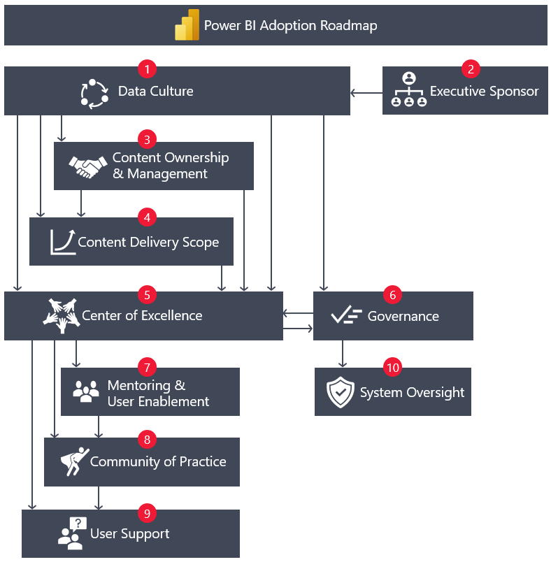
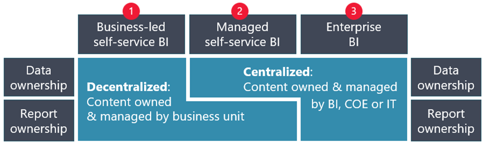
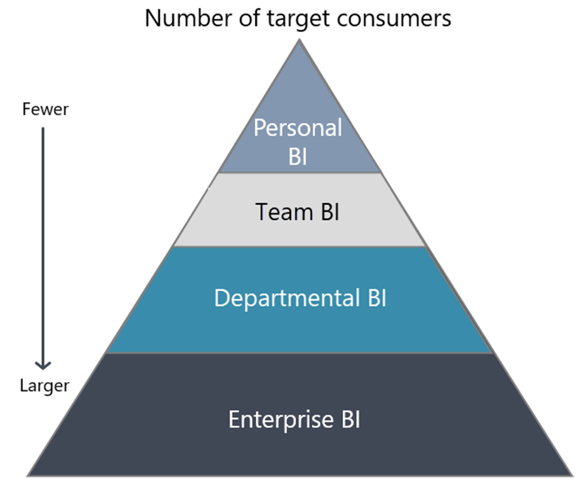
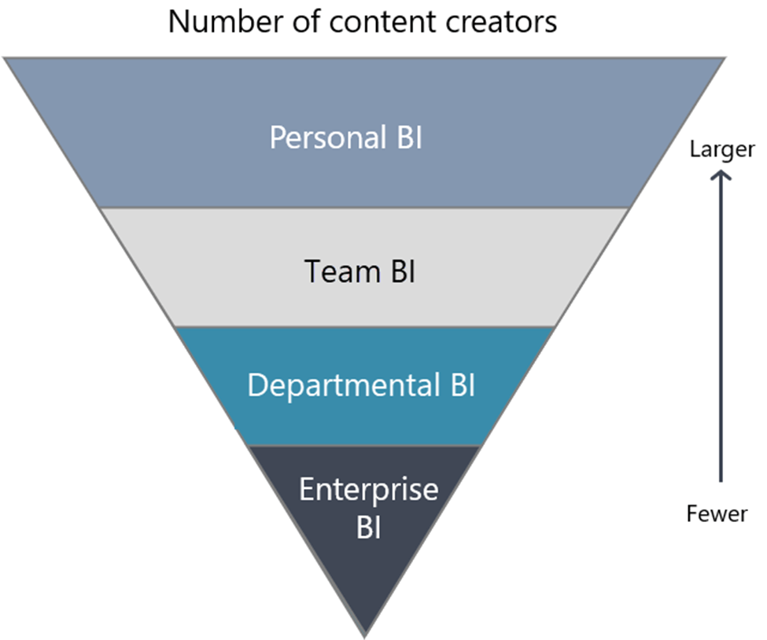
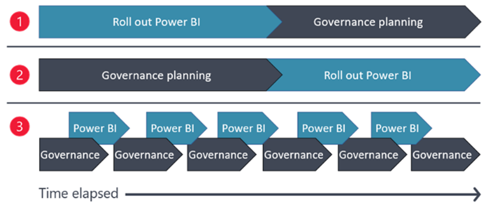
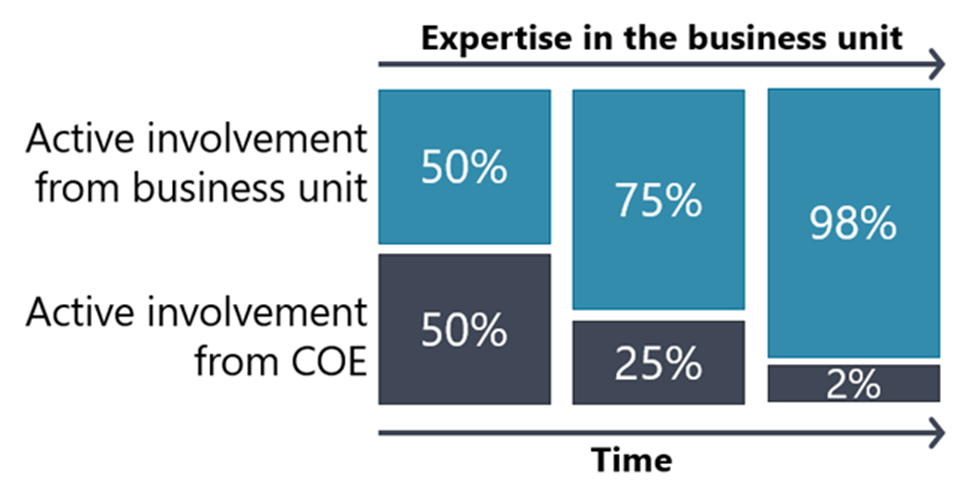
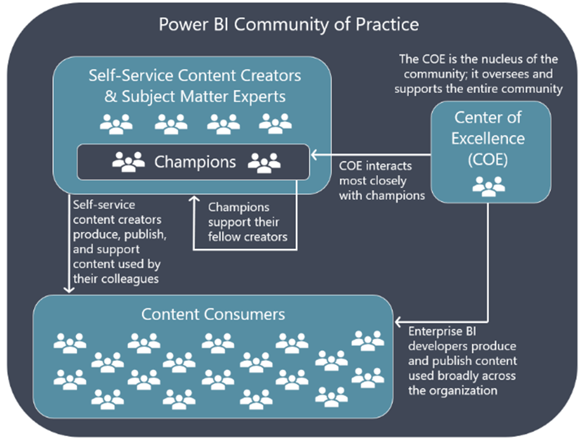
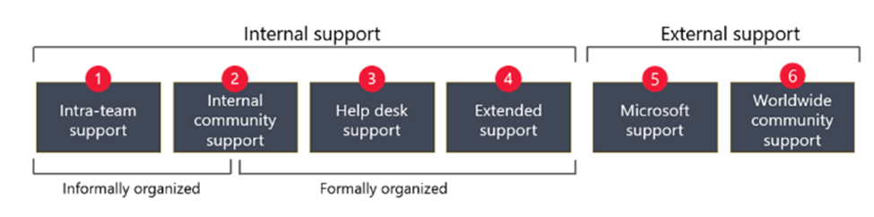

Power BI Deployment & Adoption Planning Workshop” 

Whiteboard design session trainer guide

August 2021

Information in this document, including URLs and other Internet Web site references, is subject to change without notice. Unless otherwise noted, the example companies, organizations, products, domain names, e-mail addresses, logos, people, places, and events depicted herein are fictitious, and no association with any real company, organization, product, domain name, e-mail address, logo, person, place or event is intended or should be inferred. Complying with all applicable copyright laws is the responsibility of the user. Without limiting the rights under copyright, no part of this document may be reproduced, stored in or introduced into a retrieval system, or transmitted in any form or by any means (electronic, mechanical, photocopying, recording, or otherwise), or for any purpose, without the express written permission of Microsoft Corporation.

Microsoft may have patents, patent applications, trademarks, copyrights, or other intellectual property rights covering subject matter in this document. Except as expressly provided in any written license agreement from Microsoft, the furnishing of this document does not give you any license to these patents, trademarks, copyrights, or other intellectual property.

The names of manufacturers, products, or URLs are provided for informational purposes only and Microsoft makes no representations and warranties, either expressed, implied, or statutory, regarding these manufacturers or the use of the products with any Microsoft technologies. The inclusion of a manufacturer or product does not imply endorsement of Microsoft of the manufacturer or product. Links may be provided to third party sites. Such sites are not under the control of Microsoft and Microsoft is not responsible for the contents of any linked site or any link contained in a linked site, or any changes or updates to such sites. Microsoft is not responsible for webcasting or any other form of transmission received from any linked site. Microsoft is providing these links to you only as a convenience, and the inclusion of any link does not imply endorsement of Microsoft of the site or the products contained therein.

© 2021 Microsoft Corporation. All rights reserved.

Microsoft and the trademarks listed at https://www.microsoft.com/en-us/legal/intellectualproperty/Trademarks/Usage/General.aspx are trademarks of the Microsoft group of companies. All other trademarks are property of their respective owners.

**Contents**

<!-- TOC -->

- [Trainer information](#trainer-information)
  - [Role of the trainer](#role-of-the-trainer)
  - [Whiteboard design session flow](#whiteboard-design-session-flow)
  - [Before the whiteboard design session: How to prepare](#before-the-whiteboard-design-session-how-to-prepare)
  - [During the whiteboard design session: Tips for an effective whiteboard design session](#during-the-whiteboard-design-session-tips-for-an-effective-whiteboard-design-session)
<!--- [SAP plus extend and innovate student guide](#sap-plus-extend-and-innovate-student-guide)
  - [Abstract and learning objectives](#abstract-and-learning-objectives)
  - [Step 1: Review the customer case study](#step-1-review-the-customer-case-study)
    - [Customer situation](#customer-situation)
    - [Customer needs](#customer-needs)
    - [Customer objections](#customer-objections)
    - [Infographic for common scenarios](#infographic-for-common-scenarios)
  - [Step 2: Design a proof of concept solution](#step-2-design-a-proof-of-concept-solution)
  - [Step 3: Present the solution](#step-3-present-the-solution)
  - [Wrap-up](#wrap-up)
  - [Additional references](#additional-references)
- [SAP: Extend and Innovate with Microsoft Azure whiteboard design session trainer guide](#sap-extend-and-innovate-with-microsoft-azure-whiteboard-design-session-trainer-guide)
  - [Step 1: Review the customer case study](#step-1-review-the-customer-case-study-1)
  - [Step 2: Design a proof of concept solution](#step-2-design-a-proof-of-concept-solution-1)
  - [Step 3: Present the solution](#step-3-present-the-solution-1)
  - [Wrap-up](#wrap-up-1)
  - [Preferred target audience](#preferred-target-audience)
  - [Preferred solution](#preferred-solution)
    - [Customer Needs](#customer-needs-1)
    - [Checklist of preferred objection handling](#checklist-of-preferred-objection-handling)
  - [Customer quote (to be read back to the attendees at the end)](#customer-quote-to-be-read-back-to-the-attendees-at-the-end)
  - [Additional Resources](#additional-resources)-->

<!-- /TOC -->

# Trainer information

Thank you for taking time to support the whiteboard design sessions as a trainer!

## Role of the trainer

An amazing trainer:

- Creates a safe environment in which learning can take place.

- Stimulates the participant's thinking.

- Involves the participant in the learning process.

- Manages the learning process (on time, on topic, and adjusting to benefit participants).

- Ensures individual participant accountability.

- Ties it all together for the participant.

- Provides insight and experience to the learning process.

- Effectively leads the whiteboard design session discussion.

- Monitors quality and appropriateness of participant deliverables.

- Effectively leads the feedback process.

## Whiteboard design session flow

Each whiteboard design session uses the following flow:

**Step 1: Review the customer case study (15 minutes)**

**Outcome**

Analyze your customer's needs.

- Customer's background, situation, needs and technical requirements

- Current customer infrastructure and architecture

- Potential issues, objectives and blockers

**Step 2: Design a proof of concept solution (120-180 minutes)**

**Outcome**

Design a solution and prepare to present the solution to the target customer audience in a 15-minute whiteboard format.

- Determine your target customer audience.

- Determine customer's business needs to address your solution.

- Design and diagram your solution.

- Prepare to present your solution.

**Step 3: Present the solution (30 minutes)**

**Outcome**

Present solution to your customer:

- Present solution

- Respond to customer objections

- Receive feedback

**Wrap-up (15 minutes)**

- Review preferred solution

## Before the whiteboard design session: How to prepare

Before conducting your first whiteboard design session:

- Read the Student guide (including the case study) and Trainer guide.

- Become familiar with all key points and activities.

- Plan the point you want to stress, which questions you want to drive, transitions, and be ready to answer questions.

- Prior to the whiteboard design session, discuss the case study to pick up more ideas.

- Make notes for later.

## During the whiteboard design session: Tips for an effective whiteboard design session

**Do not expect to memorize every detail** of the whiteboard design session.

When participants are doing activities, you can **look ahead to refresh your memory**.

- **Adjust activity and whiteboard design session pace** as needed to allow time for presenting, feedback, and sharing.

- **Add examples, points, and stories** from your own experience. Think about stories you can share that help you make your points clearly and effectively.

- **Consider creating a "parking lot"** to record issues or questions raised that are outside the scope of the whiteboard design session or can be answered later. Decide how you will address these issues, so you can acknowledge them without being derailed by them.

***Have fun**! Encourage participants to have fun and share!*

**Involve your participants**. Talk and share your knowledge but always involve your participants, even while you are the one speaking.

**Ask questions** and get them to share to fully involve your group in the learning process.

**Ask first**, whenever possible. Before launching into a topic, learn your audience's opinions about it and experiences with it. Asking first enables you to assess their level of knowledge and experience and leaves them more open to what you are presenting.

**Wait for responses**. If you ask a question such as, "What's your experience with (fill in the blank)?" then wait. Do not be afraid of a little silence. If you leap into the silence, your participants will feel you are not serious about involving them and will become passive. Give participants a chance to think, and if no one answers, patiently ask again. You will usually get a response.

# Power BI Deployment & Adoption Planning Workshop student guide

## Case study

Contoso Healthcare has some groups in their organization that started utilizing Power BI with some success particularly in providing dashboards to the Operations staff. They have added several widescreen monitors that display the dashboards so everyone can quickly understand the current call volume, current tickets outstanding and many other metrics.

Due to various individuals walking by the Operations department there have been many requests from other parts of the organization on to create the same kind of dashboards. The Emergency department subsequently has worked with IT and created their own dashboards that provide current wait times, scheduling, and call volumes.

IT is getting more and more requests to provide additional Power BI reports after people hearing about and seeing the dashboards. But they don’t have any ability to provide support or govern who has access to the data in the reports. Because of the ad-hoc requests to build reports with Power BI there are some questions starting to come up as to the value of some of the reports and also who should be maintaining and supporting them.

Additionally, there are questions whether different parts of the organization would be able to self-service their report needs or even provide train the trainer courses. While the IT staff have a strong background in data, they are limited in knowledge with controlling the proliferation of reports as they are being added in the organization. Currently, there are no plans to provide documentation or even best practices because the current implementations are very ad-hoc and narrow in scope.

Because of the disparate facilitates providing access to that information should also be trimmed because smaller physician offices should not be able to see information about the main hospital or other physician offices.

Because the healthcare industry is very focused on acquisitions the deployment needs to be setup as something that is reproducible and scalable so setting up the environment and policies around it are extremely important.

## Step 1: Review the customer case study

**Outcome**

Analyze your customer's needs.

Timeframe: 15 minutes

Directions: With all participants in the session, the facilitator/SME presents an overview of the case study.

1.  Meet your table participants and trainer.

1.  Read all of the directions for steps 1-3 in the student guide.

1.  As a table team, review the following and identify opportunities with the Power BI Adoption Framework in mind.

### Customer case study continued
Contoso Healthcare has been in their original location for 20 years and currently focused on expansion and acquisition. There are currently 10,000 employees that are in their Azure Active Directory and they currently have 20 satellite physician offices with a goal of more than doubling that number in the next 2 years. The satellite offices are unique because every office is an acquisition and they need to immediately begin using the parent organizations procedures and standards for quality care. So they need their existing data integrated as fast as possible.

Because of the size of the organization and the assumption that all technology is led through IT efforts there has not been a focus on providing Business Intelligence capabilities to the organization. Currently the main source of reports is generated by hand utilizing Excel and shared either by email or SharePoint.
Because of how reports are currently handled there are ongoing concerns over different parts of the organization having access to reports they should not have access to. 

Additionally, with all the reports generated by hand and also many legacy reports being used for many years there is no consistency. With many new offices being assimilated they tend to have their own methodologies for generating reports and this creates even more inconsistency.

Also, if someone does reach out to support to look for either a template or a best practice there is no information available to provide. No individual has provided any training or mentoring to the support staff or online. So, the situation never gets better because there is a

 - a lack of standards
 - lack of documentation
 - no one has been empowered to start the process
 
With the increasing organization size the IT department has become a hindrance in not only providing access to systems because there no plan to govern who has access, how long they will need access, and what kind of access they would need.

### Customer needs
Utilize the Power BI Adoption Roadmap to define the best option(s) for adopting Power BI in the organization.
1.	**Maturity level** – The organization is looking to move past undocumented practices and tribal knowledge.
2.	**Executive sponsor** – The CEO is looking at hiring a Chief Data Officer to lead the organization and assist with adoption.
3.	**Content ownership** – The organization realizes that IT can be a bottle-neck and wants smaller parts of the organization to be in charge of the content.
4.	**Content delivery scope** – Both the content consumers and content creators are going to be very specific to the departments they belong too. 
5.	**Center of Excellence** – The organization would like to take the existing teams that are having positive results and allow them to share knowledge to other teams.
6.	**Governance** – To prevent delays in adoption the organization would like to start with loose governance standards and add more as time goes on.
7.	**Mentoring and user enablement** – The organization has experience using a “train the trainer” methodology in the past and would like to continue using that in the future. 
8.	**Community of practice** - The organization has experience using a “train the trainer” methodology in the past and would like to continue using that in the future. This includes lunch & learns and using SharePoint as a knowledge sharing tool. 
9.	**User Support** – The organization would like to utilize their existing Support desk for user support. 

### Customer objections
1. No migrations of existing data is in scope
2. Net new data storage can potentially stored in the cloud
3. How can we ensure compliance and also eliminate the potential for different offices from seeing each others information?

### Infographic for Power BI Adoption

When implementing Power BI in an organization it is important to understand all the different facets that make up a proper implementation.

## Step 2 Plan Adoption Plan Strategy 

### Outcome

Based on the customer needs design a Adoption Plan Strategy that fits.

**Timeframe**: 60 minutes

### Business needs

Directions: With all participants at your table, answer the following questions and list the answers on a flip chart:
1.	Who should you present this solution to? Who is your target customer audience? Who are the decision makers?
2.	What customer business needs do you need to address with your solution?

### Design

Directions: With all participants at your table, respond to the following questions on a flip chart:

#### Envision pitch

1.	How will you tie the business needs of Contoso Healthcare to adopt Power BI?
2.	Design a solution and prepare to present the solution that incorporates the Adoption Roadmap/Framework to plan an adoption plan to the target customer audience in a 15-minute PowerPoint format.

## Step 3: Present the solution

### Outcome

Present a solution to the target customer audience in a 15-minute PowerPoint presentation format.

Validate and identify the customer needs in from the Power BI Roadmap/Framework. The presentation should outline the adoption of the Power BI Roadmap/Framework

Timeframe: 30 minutes (15 minutes per team presentation)

### Presentation

**Directions**:
1. Pair with another table.
2. One table is the Microsoft team and the other table is the customer.
3. The Microsoft team presents their proposed solution to the customer.
4. The customer makes one of the objections from the list of objections.
5. The Microsoft team responds to the objection.
6. The customer team gives feedback to the Microsoft team.
7. Tables switch roles and repeat Steps 2-6.

## Wrap-up

**Timeframe**: 15 minutes
Directions: Tables reconvene with the larger group to hear the facilitator/SME share the preferred solution for the
case study.

## Additional references

# Power BI Deployment & Adoption Planning Workshop trainer guide

## Step 1: Review the customer case study

* Check in with your table participants to introduce yourself as the trainer.
* Ask, "What questions do you have about the customer case study?"
* Briefly review the steps and timeframes of the whiteboard design session.
* Ready, set, go! Let the table participants begin.

## Step 2: Design a proof of concept solution

* Check in with your tables to ensure that they are transitioning from step to step on time.
* Provide some feedback on their responses to the business needs and design.
    - Try asking questions first that will lead the participants to discover the answers on their own.
* Provide feedback for their responses to the customer's objections.
    - Try asking questions first that will lead the participants to discover the answers on their own

## Step 2: Design a proof of concept solution
* Determine which table will be paired with your table before Step 3 begins.
* For the first round, assign one table as the presenting team and the other table as the customer.
* Have the presenting team present their solution to the customer team.
* Have the customer team provide one objection for the presenting team to respond to.
* The presentation, objections, and feedback should take no longer than 15 minutes.
* If needed, the trainer may also provide feedback.

## Step 3: Present the solution

* Determine which table will be paired with your table before Step 3 begins.
* For the first round, assign one table as the presenting team and the other table as the customer.
* Have the presenting team present their solution to the customer team.
     - Have the customer team provide one objection for the presenting team to respond to.
    - The presentation, objections, and feedback should take no longer than 15 minutes.
    - If needed, the trainer may also provide feedback

## Wrap-up

Have the table participants reconvene with the larger session group to hear the facilitator/SME share the following preferred solution

## Preferred solution 
•	**Executive sponsor** - <u>Top-down pattern</u>. The ideal situation would be to hire a (CDO) Chief Data Officer. Having a Power BI executive sponsor at the C-level is an excellent indicator. It indicates that the organization recognizes the importance of data as a strategic asset and is advancing its data culture in a positive direction.
https://docs.microsoft.com/en-us/power-bi/guidance/powerbi-adoption-roadmap-executive-sponsorship#top-down-pattern

•	**Content ownership and management** - <u>Business-led self-service</u> BI: All content is owned and managed by the creators and subject matter experts within a business unit. This ownership strategy is also known as a decentralized or bottom-up BI strategy.
https://docs.microsoft.com/en-us/power-bi/guidance/powerbi-adoption-roadmap-content-ownership-and-management#business-led-self-service-bi 

•	Content delivery scope - 
Content delivery - Departmental BI: Delivers content to a large number of consumers, who can belong to a department or business unit.
Content creators - Departmental BI: Involves a smaller population of creators. They are likely to be considered power users who are using sophisticated tools to create sophisticated solutions. Managed self-service BI practices are very common and highly encouraged.

•	**Center of Excellence** - <u>Federated COE</u>: A federated COE comprises a shared services team plus satellite members from each functional area or major business unit. A federated team works in coordination, even though its members reside in different business units. Typically, satellite members are primarily focused on development activities to support their business unit while the shared services personnel support the entire community.
https://docs.microsoft.com/en-us/power-bi/guidance/powerbi-adoption-roadmap-center-of-excellence#federated-coe

•	**Governance** - <u>Method 3</u> seeks a balance between agility and governance. It's an ideal scenario that does just enough governance planning upfront. Frequent and continual governance improvements iteratively occur over time alongside Power BI development projects that deliver value.
https://docs.microsoft.com/en-us/power-bi/guidance/powerbi-adoption-roadmap-governance#method-3-iterative-governance-with-rollouts

•	**Mentoring and user enablement** – A <u>co-development project</u> is a form of assistance offered by the COE where a user or business unit takes advantage of the technical expertise of the COE to solve business problems with data. Co-development involves stakeholders from the business unit and the COE working in partnership to build a high-quality self-service BI solution that the business stakeholders could not deliver independently.
https://docs.microsoft.com/en-us/power-bi/guidance/powerbi-adoption-roadmap-mentoring-and-user-enablement#co-development-projects 

•	**Community and practice** - The overriding objective of a community of practice is to facilitate knowledge <u>sharing among colleagues and across organizational boundaries</u>. There are many ways knowledge sharing occurs. It could be during the normal course of work.
https://docs.microsoft.com/en-us/power-bi/guidance/powerbi-adoption-roadmap-community-of-practice#knowledge-sharing 

•	**User support** - <u>Intra-team support</u> refers to when team members learn from and help each other during their daily work. People who emerge as your Power BI champions tend to take on this type of informal support role voluntarily because they have an intrinsic desire to help. Although it's an informal support mode, it should not be undervalued. Some estimates indicate that a large percentage of learning at work is peer learning, which is particularly helpful for analysts who are creating domain-specific Power BI solutions.
https://docs.microsoft.com/en-us/power-bi/guidance/powerbi-adoption-roadmap-user-support#intra-team-support 

## Customer quote (to be read back to the attendees at the end)

"Microsoft has designed a secure and manageable infrastructure that can grow with Contoso Healthcare. This depthand breadth will allow us to meet both our business needs and regulatory requirements for our applications. Not to mention ensuring that our healthcare practitioners will have access to the patient data that they need when they need it."

Ken Greenwald, CTO of Contoso Healthcare

## Additional Resources  

